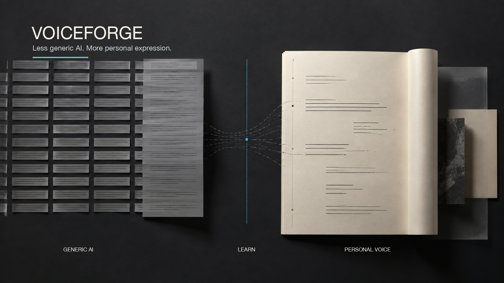

<div align="center">
  <h1>Voiceforge</h1>
  <p><em>Reduce generic AI phrasing. Learn personal expression.</em></p>
</div>

Voiceforge is a writing Skill for Chinese and English writing. It helps an LLM produce less
generic, more personal text by retrieving relevant human writing methods and learning from
user-confirmed samples and explicit preferences for the current task.

It applies a personal voice only when authorship and current representativeness are confirmed.
Account ownership, publication location, and silence are not treated as proof of a writing style.

The repository contains reusable Skill instructions and deterministic Python tooling. It does not
contain a user's articles, voice profile, corpus registry, feedback journal, or holdout samples.

<p align="center">
  
</p>

## What It Is For

Use Voiceforge when a writing task needs more than a generic style prompt:

- reduce generic AI phrasing while preserving facts and user constraints;
- learn personalized expression from confirmed writing samples and explicit preferences;
- retrieve human-authored writing methods for a specific language, genre, audience, and purpose;
- draft, revise, and compare text against approved writing;
- preserve explicit feedback without turning unconfirmed signals into permanent rules.

## Why It Exists

A generic style prompt can make prose sound polished without making it sound like a particular
person. Voiceforge treats personal expression as evidence that must be confirmed, scoped, and
updated through explicit feedback.

The system keeps different kinds of writing evidence in separate channels:

- **Task evidence** supplies claims, examples, and conclusions.
- **Confirmed personal samples** shape voice, rhythm, structure, and recurring preferences.
- **Human references** contribute writing methods, never the user's identity, opinions, or facts.
- **Feedback and negative samples** record what the user explicitly prefers or rejects.

The system does not infer personal authorship from an account name, publication location, or
silence. Candidate samples stay out of drafting context until the user confirms authorship and
current representativeness. Secret records and human references whose rights do not match the
intended use are excluded before retrieval.

## Quick Start

Link a local checkout into the shared Agent Skills directory:

```bash
mkdir -p ~/.agents/skills
ln -sfn /path/to/Voiceforge ~/.agents/skills/voiceforge
```

Validate the knowledge base before using it:

```bash
python3 scripts/voice_memory.py validate --vault /path/to/knowledge-base
```

Retrieve scoped style evidence for a writing task:

```bash
python3 scripts/voice_memory.py context \
  --vault /path/to/knowledge-base \
  --language zh --genre technical-article --audience public \
  --intended-use unknown --query "主题和写作目的"
```

When the task facts already exist in a source or journal record, prepare them separately from
the style context:

```bash
python3 scripts/voice_memory.py prepare \
  --vault /path/to/knowledge-base \
  --fact-packet 02-sources/fact-packet.md \
  --language zh --genre technical-article --audience public \
  --intended-use unknown --query "主题和写作目的"
```

## How It Works

1. Locate and validate the Markdown vault.
2. Classify the request by language, genre, audience, channel, purpose, and intended use.
3. Retrieve a small, scope-aware context. Claims go to `fact_evidence`; expression guidance goes
   to `style_context`.
4. Draft from task evidence, then express the information order through the eligible style
   evidence. Candidate personal samples never act as fallback evidence.
5. Analyze the draft and finish with factual, privacy, citation, audience, and constraint checks.
6. Record feedback only after an explicit user revision, acceptance, rejection, or preference.

Voiceforge remains in `shadow` activation mode until its machine-checked evidence gates pass. A
healthy registry means the data follows the schema; it does not by itself prove that the personal
profile is mature or ready to replace the default writing route.

## What It Contains

| Layer | Role |
| --- | --- |
| Universal baseline | Preserves facts, uncertainty, complete relationships, privacy, and user constraints |
| Human writing library | Stores provenance, rights, scope, and short technique evidence |
| Human Technique Index | Provides curator-maintained retrieval cues without becoming a hidden prompt |
| Personal voice profile | Stores only user-confirmed samples and durable preferences |
| Scoped retrieval | Selects evidence for the current language, genre, audience, and intended use |
| Feedback memory | Keeps append-only before/after records and explicit negative evidence |
| Holdout evaluation | Measures factual fidelity, constraint fidelity, editing burden, and generalization |

## Per-user Data

Each user supplies a private Markdown vault. The usual records are:

```text
05-areas/writing-style/Corpus Registry.md
05-areas/writing-style/Voice Profile.md
05-areas/writing-style/Human Technique Index.md
08-journal/writing-feedback/
08-journal/writing-sample-confirmations/
```

The registry stores paths and metadata, not a copied corpus. A user can run Voiceforge without
confirmed personal samples; the Skill then uses the universal baseline and eligible human-reference
techniques and treats the personal profile as provisional.

## Repository Layout

| Path | Purpose |
| --- | --- |
| `SKILL.md` | Runtime instructions, evidence boundaries, and routing policy |
| `agents/openai.yaml` | Display metadata and the default prompt |
| `references/architecture.md` | Data flow and separation between evidence channels |
| `references/corpus-schema.md` | Registry and Human Technique Index schema |
| `references/evaluation.md` | Test sets, rollout gates, and promotion criteria |
| `references/preference-memory.md` | Confirmed preference storage and supersession rules |
| `scripts/voice_memory.py` | Deterministic registry, retrieval, feedback, and evaluation CLI |
| `tests/test_voice_memory.py` | Regression tests for the CLI and memory rules |

## Common Commands

Inspect a draft against the confirmed profile:

```bash
python3 scripts/voice_memory.py analyze \
  --vault /path/to/knowledge-base --file /path/to/draft.md \
  --language zh --genre technical-article --audience public
```

Preview a feedback record before writing it:

```bash
python3 scripts/voice_memory.py feedback \
  --vault /path/to/knowledge-base \
  --before /path/to/draft.md --after /path/to/user-final.md \
  --verdict revised --task-id example-task \
  --language zh --genre technical-article --audience public
```

Run the regression suite from the repository root:

```bash
python3 -m unittest discover -s tests -p 'test_*.py'
```

## Relationship With oil-tone

Voiceforge is the canonical Skill for evidence separation, scope-aware retrieval, controlled
memory, and activation readiness. `oil-tone` remains the compatibility layer and deterministic
final lint for the universal expression floor. It does not maintain a second personal-memory
model or replace Voiceforge's evidence rules.

## Boundaries

Voiceforge does not fine-tune a model, place an entire writing library in a static prompt, or
reproduce a living writer's distinctive expression. Style examples are not factual sources, and
semantic similarity is not proof of stylistic similarity. Personal data stays in the user's
private vault; only reusable implementation belongs in this repository.

## License

MIT. See [LICENSE](LICENSE).
